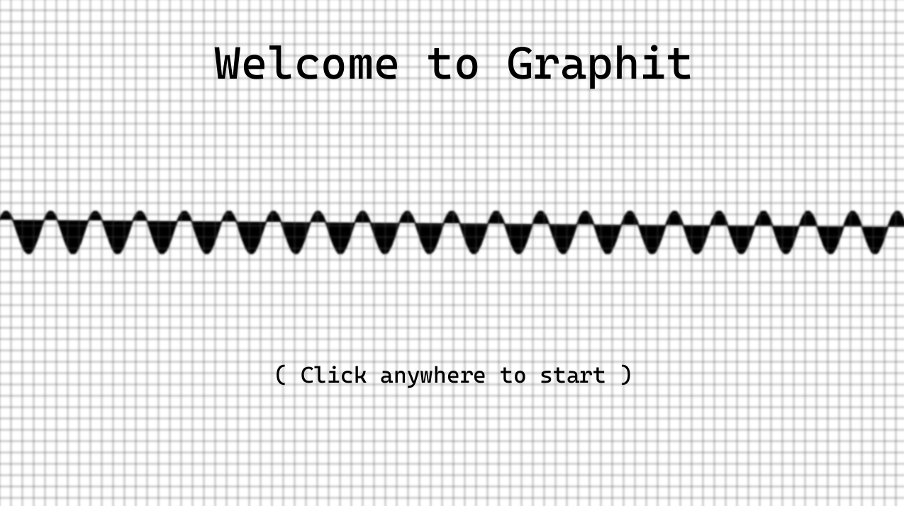
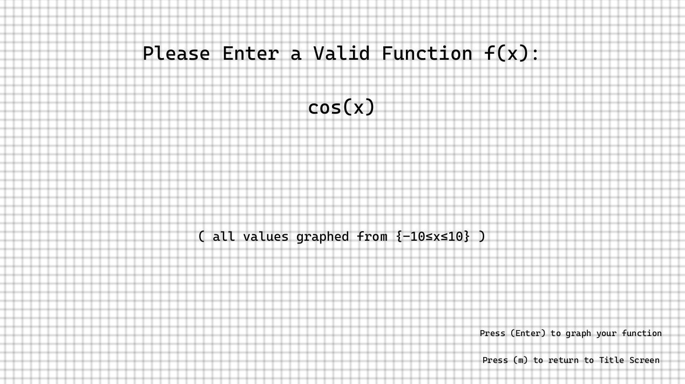
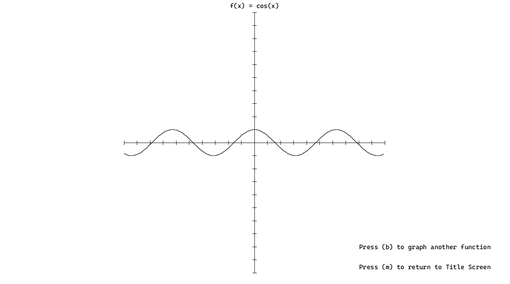

# Graphit
Small demo program in Processing that graphs functions from user input.

--Valid Functions include linear,exponential,trig,and logarithmic(ln).

Sample Photos:

# Program Overview
-After launching the program, the user sees the main menu, in which they are prompted to click anywhere in order to move on to the next page

-After entering a valid function f(x) and pressing enter, the graph of desired function is graphed and displayed from {-10<=x<=10}

-Instructions are given on how to navigate pages by pressing certain keys

# How To Run Program
1. Make sure you are able to run Processing code
2. Download all files from repository into a folder
3. Launch graphing.pde and run

Enjoy!

Music Credit: https://www.youtube.com/watch?v=D5L36JDKxR0&list=PLdsGes2mFh92eHpOZVJQgoubb6rF0CcvU&ab_channel=Pix
